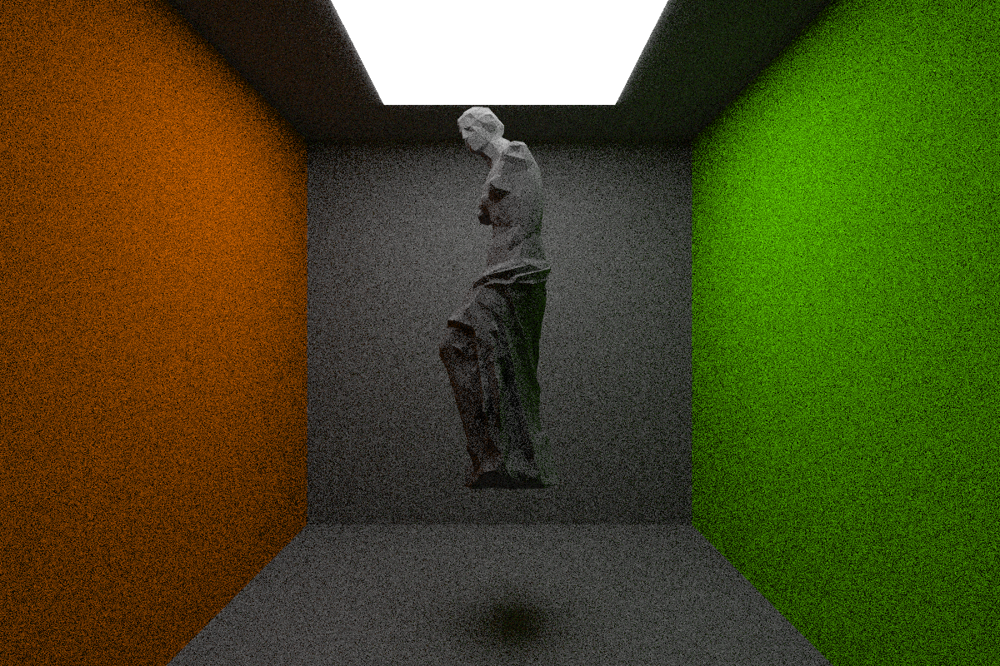
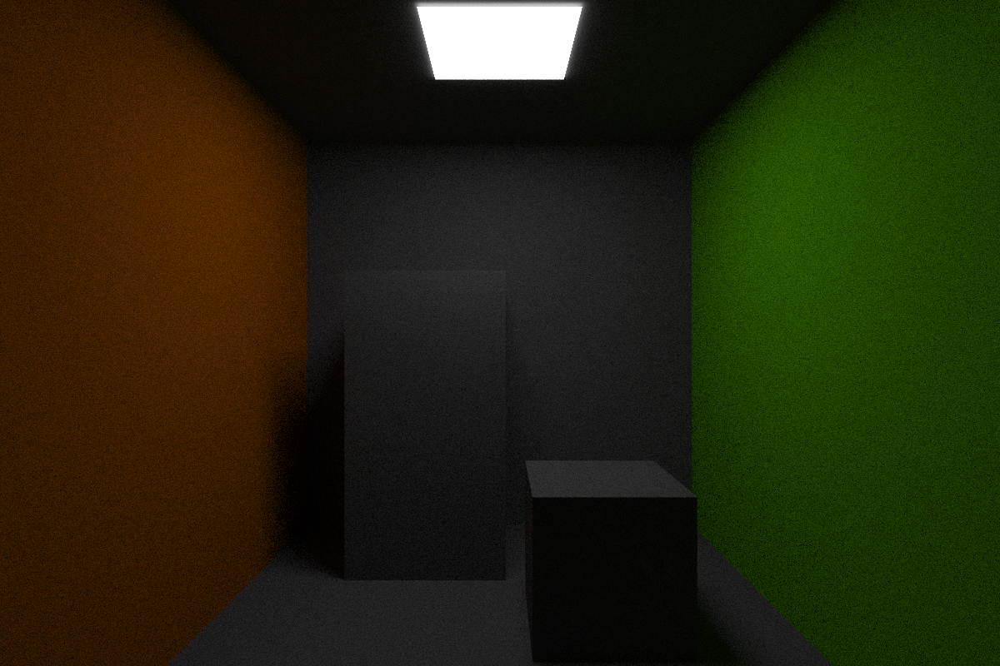
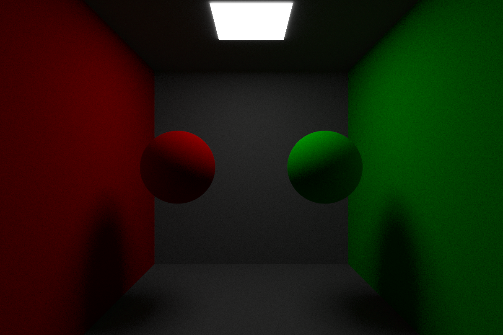

# AliceTracer
### A Ray Tracer Demo 
Currently, I build this based on the path tracing algorithm, which is a general method for scene rendering.

### Showcase
#### Vanilla Monte Carlo for Path Tracing
- Cornell Box

- Area Lighting

- Lambert Primitives

