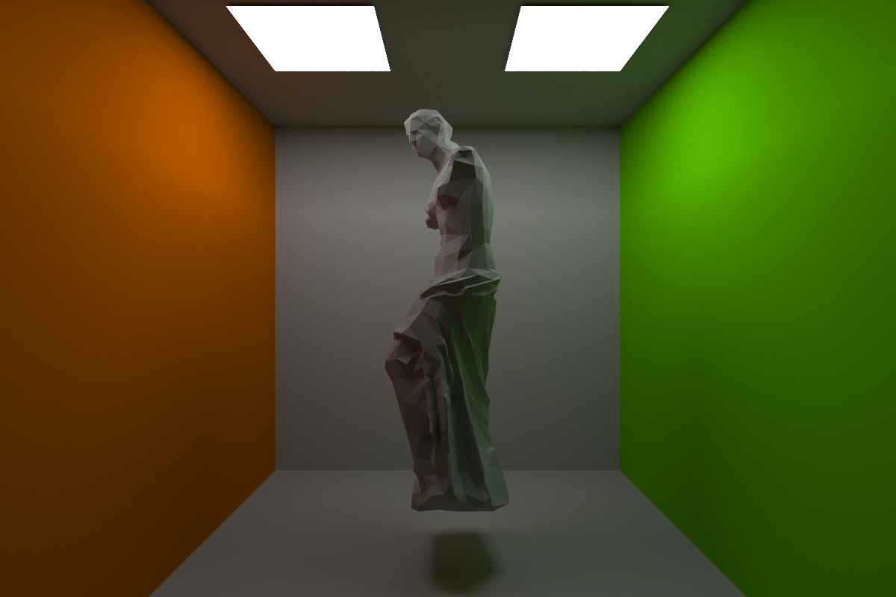
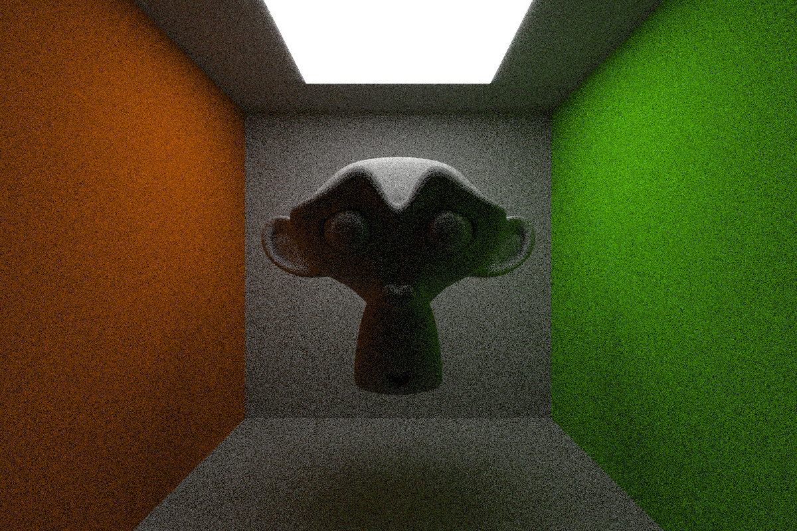

# AliceTracer
### A Ray Tracer Demo 
Currently, I build this based on the path tracing algorithm, which is a general method for scene rendering.

### Features
#### - Spatial Separation
- Naive BVH
####  - Integrator
- Vanilla Monte Carlo 
- Next Event Estimate
- Multiple Importance Sampling
#### - Materials
- Lambert Diffuse

#### - Lights
- Rectangle Area Lights

### - TODO
- More Materials
    - Disney Materials
- Bidirectional Monte Carlo with Multiple Importance
- Multiple-Thread BVH/ Optimized BVH

### Showcases
#### Monte Carlo for Path Tracing
- Cornell Box

- Area Lighting

- Lambert Sphere

